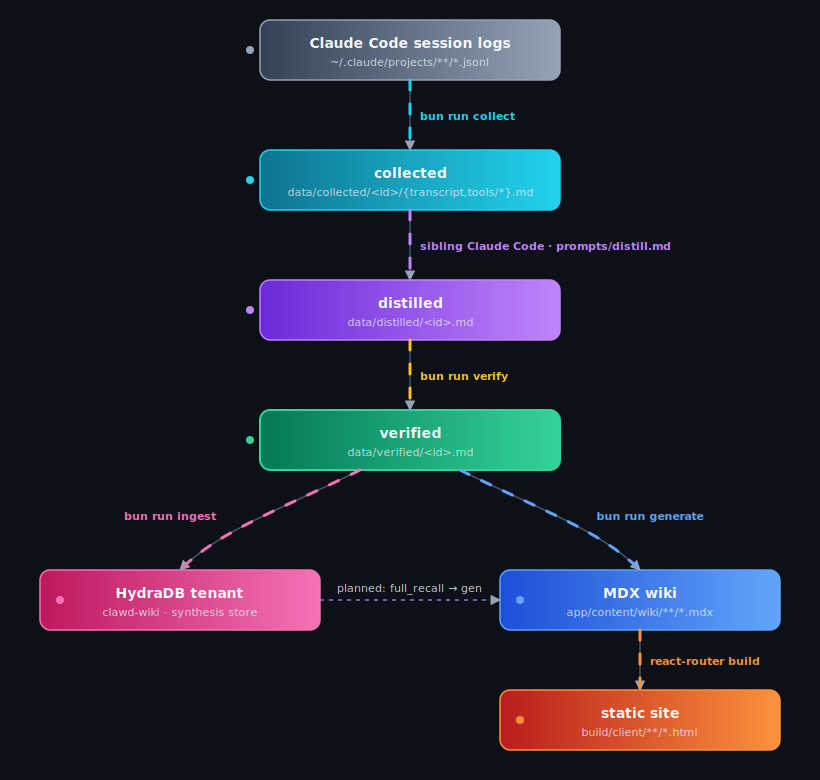

# clawd-wiki

A wiki-style index of knowledge mined from Claude Code session transcripts, built for future agents to navigate. Each page is a mini-article (prose + verbatim code + alternatives) rather than a terse bullet list — inspired by Karpathy's LLM-wiki pattern and the Farzapedia generation skill.

The pipeline walks `~/.claude/projects/**/*.jsonl`, scrubs PII, distills each session with parallel Sonnet subagents, normalizes and lints the output, ingests it into HydraDB, and renders a static React Router SSG site.

## Pipeline

<p align="center">
  
</p>

<details>
<summary>Text version</summary>

```
~/.claude/projects/**/*.jsonl
  → bun run collect       walk + scrub
data/collected/<id>/{transcript.md, tools/*.md}
  → sibling Claude Code session driven by prompts/distill.md
data/distilled/<id>.md
  → bun run verify        scrub + normalize frontmatter + lint slug graph
data/verified/<id>.md
  → bun run ingest        upload to HydraDB (idempotent via data/state.sqlite)
  → bun run generate      slug graph → MDX
app/content/wiki/{index,projects,concepts,pitfalls,work-units}/*.mdx
  → bun run build         react-router prerender
build/client/**/*.html
```

</details>

## Scripts

| Command | What it does |
| --- | --- |
| `bun run collect` | Walk Claude Code project logs, scrub credentials/PII, write per-session transcript + tool-call sidecars under `data/collected/`. |
| `bun run distill` | Helper for the sibling distillation session (prompts live in `prompts/`). |
| `bun run verify` | Post-distill gate: re-scan for PII, normalize YAML frontmatter, lint the slug graph; quarantine on conflict. |
| `bun run ingest` | Upload verified notes to HydraDB tenant `clawd-wiki`. Flags: `--init-tenant`, `--status`, `--force`, `--limit N`, `--poll`. |
| `bun run generate` | Read `data/verified/*.md`, emit MDX into `app/content/wiki/`. |
| `bun run dev` | React Router dev server for live page inspection. |
| `bun run build` | `generate` + `react-router build` → static site in `build/client/`. |
| `bun run start` | Serve the built site locally. |
| `bun run type` | `react-router typegen` + `tsc --noEmit`. |

`scripts/recall.ts "query"` is a smoke test against `full_recall` for the HydraDB tenant.

## Setup

Requires [Bun](https://bun.sh) (the pipeline scripts use Bun APIs).

```sh
bun install
cp .env.example .env   # fill in HYDRA_API_KEY and HYDRA_TENANT_ID
bun run ingest -- --init-tenant
```

## Layout

- `scripts/` — pipeline stages (`collect`, `verify`, `ingest`, `generate`, `recall`) plus shared helpers in `scripts/lib/` (scrub, normalize, lint, slugs, render, upload, ssg).
- `prompts/` — `distill.md` (orchestrator pasted into a sibling Claude Code session) and `distill-rules.md` (read from disk by each subagent per run; edit on disk and the next run picks it up).
- `app/` — React Router 7 SSG: routes for `/`, `/projects/:slug`, `/concepts/:slug`, `/pitfalls/:slug`, `/work-units/:slug`, MDX content loaded via `import.meta.glob`, Tailwind 4 + Shiki for syntax highlighting.
- `data/` — gitignored working state: `collected/`, `distilled/`, `verified/`, `state.sqlite` (ingest ledger).
- `config/` — runtime config (scrub denylist, project path roots, etc.).
- `docs/` — design references: Karpathy's LLM-wiki note, the Farzapedia skill, the HydraDB `llms.txt`.

## Scrubbing

Three layers defend against leaking session content:

1. Regex pre-scrub at collect time (`scripts/lib/scrub.ts`): credentials, paths, emails, IPs, phones, denylist. Paths under configured project roots collapse to `<PATH:project=NAME>` so project names survive as anchors.
2. LLM-driven redaction rules in `prompts/distill-rules.md` — explicit KEEP (project / library / code identifiers) vs STRIP (people, companies, paths, emails, IPs, internal jargon).
3. `scripts/verify.ts` re-runs the scan post-distill and quarantines on any surviving PII match.

## HydraDB

Uses `@hydradb/sdk` against tenant `clawd-wiki`. One `app_knowledge` source per verified note; tenant metadata `{ project, session_id, branch }` is filterable. Idempotency via `data/state.sqlite` keyed on session id + SHA-256 of the verified markdown.
